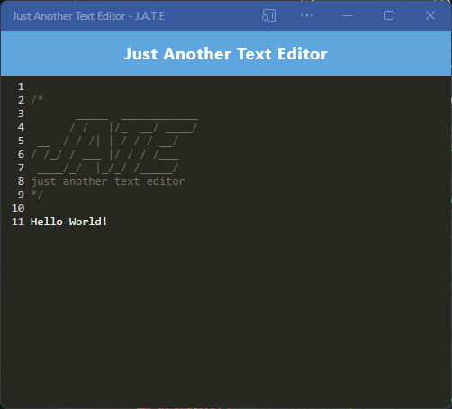

# PWA-Text-Editor

## Description

This is a basic web based text editor. It can be installed as a PWA and uses IndexedDB to store changes made in the app.

## Screenshot

## Link

GitHub Repo:
https://github.com/auswaller/PWA-Text-Editor

Heroku Deployment:
https://sleepy-thicket-78628-eb3f310e9b75.herokuapp.com
